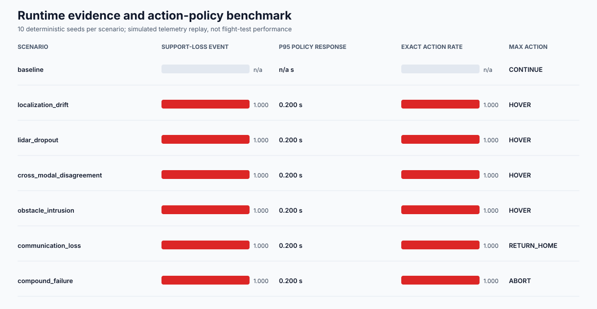

# Runtime Evidence Assurance for UAV Telemetry

[](https://github.com/Aleck-Tao/runtime-safety-assurance-uav/actions/workflows/ci.yml)

A telemetry replay study of how an assurance argument changes when the evidence for continuing a UAV mission degrades. Six monitors track localization, sensor freshness, cross-modal agreement, stopping margin, communication, and fallback availability. Their persistent states update a fixed claim graph and select a recommendation from `CONTINUE` through `ABORT`.

The main question is whether the supervisor chooses the right action at the right time, and whether the reported metrics make its delay and conservatism visible. The committed experiment contains 70 synthetic traces: seven scenarios, ten fixed seeds, and 60 seconds per trace at 10 Hz.

## What the replay shows

| Scenario | Maximum recommendation, correct runs | p95 raw failure to exact action | Unsupported coverage in first oracle-positive second |
|---|---|---:|---:|
| Baseline | `CONTINUE`, 10/10 | — | — |
| Localization drift | `HOVER`, 10/10 | 0.20 s | 100% |
| LiDAR dropout | `HOVER`, 10/10 | 0.20 s | 100% |
| Cross-modal disagreement | `HOVER`, 10/10 | 0.20 s | 99% |
| Obstacle intrusion | `HOVER`, 10/10 | 0.20 s | 80% |
| Communication loss | `RETURN_HOME`, 10/10 | 0.20 s | 100% |
| Compound failure | `ABORT`, 10/10 | 0.20 s | 90% |

The oracle is a separately configured criterion for each synthetic scenario. Coverage measures the fraction of its positive samples for which the argument is `UNSUPPORTED`; the [metric definitions](docs/methodology.md#7-benchmark-metrics-and-gates) describe the exact windows.

Three details matter more than the overall pass count:

- **The 0.20 s response follows from the persistence rule.** Failure needs three consecutive samples, so selection occurs two sample intervals after the first raw failure. This measures the supervisor's decision delay in replay. Increasing persistence would also consume more of the stopping model's response-time budget.
- **A long trace can hide that delay.** Obstacle intrusion has `99.4792%` full-horizon oracle-positive coverage but only `80%` in the first second. The two initially uncovered samples are the same in both metrics; the long denominator makes them look negligible.
- **Action priority needs its own check.** In the representative compound trace, the recommendation moves from `SLOW` at `20.2 s` to `HOVER` at `20.6 s`, then `ABORT` at `20.8 s` when fallback evidence fails. Across the fixed runs, no action exceeds the scenario's expected maximum, and no downgrade follows exact selection while the oracle remains positive.

The [run table](results/benchmark_runs.csv), [transition table](results/representative_transitions.csv), and [per-scenario timelines](results/case_timelines) support these observations. [Result analysis](docs/result_analysis.md) works through the timing, stopping-distance sensitivity, and interpretation of early intervention.



## Model and policy

```text
telemetry -> persistent monitors -> claim support + action recommendation
                                         |
                              affected constraints and hazards
```

The [STPA-informed model](hazards/stpa_model.json) links unsafe continuation contexts to constraints; the [assurance case](assurance_case/uav_runtime_case.json) links those constraints to monitor evidence. `SUPPORTED`, `DEGRADED`, and `UNSUPPORTED` describe support for the configured continuation claim. The graph stays fixed during replay.

The [policy](config/assurance_policy.json) uses two samples for warning, three for failure, and five lower-severity samples for recovery. Status and action have separate persistence counters so that changing failure types cannot accidentally restore claim support. Sustained missing or non-finite evidence selects `ABORT`.

Stopping margin is calculated as

```text
margin = distance - 1.5 - 0.5*speed - speed^2/(2*2.5).
```

Distances are in metres and time in seconds. The constants represent protected clearance, the response-time budget, and an assumed deceleration bound. Because the speed term is quadratic, increasing speed has a larger effect on the margin than the same increase at a lower speed. The [analysis](docs/result_analysis.md#stopping-margin-sensitivity) derives this relationship from the configured model.

## Run it

From a checkout with Python 3.11 or later; runtime dependencies are standard-library only:

```bash
python -m pip install -e .
runtime-assurance validate --root .
runtime-assurance verify --root .
runtime-assurance benchmark --root .
```

`benchmark` regenerates the telemetry and results. To confirm a matching replay, run `runtime-assurance verify --root .` followed by `git diff --exit-code -- data/generated results`. CI repeats this on Linux and Windows. The [traceability map](docs/traceability.md) connects the supervisor model to executable checks; [data provenance](docs/data_provenance.md) describes the source, trace, and result bindings.

## Scope

This is open-loop replay of constructed fault scenarios. Recommendations do not alter the vehicle state: the obstacle trace continues to contain non-positive stopping margins after `HOVER`. Thresholds, telemetry fidelity, clock alignment, braking capability, and fallback availability remain assumptions requiring validation on a chosen platform. The current results characterize decision logic and argument support under those assumptions; [methodology](docs/methodology.md) gives the full model and metric definitions.

## References

- Leveson and Thomas, [*STPA Handbook*](https://psas.scripts.mit.edu/home/get_file.php?name=STPA_handbook.pdf).
- [*Safe autonomous systems in a changing world: Operationalising dynamic safety cases*](https://doi.org/10.1016/j.ssci.2025.106965), *Safety Science* 191 (2025), conceptual motivation for updating operational evidence.

MIT license.
