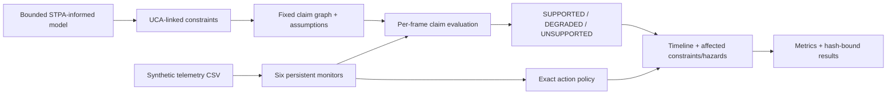

# Runtime Evidence Assurance for UAV Telemetry

[](https://github.com/Aleck-Tao/runtime-safety-assurance-uav/actions/workflows/ci.yml)
[](https://www.python.org/)
[](LICENSE)

An executable Python prototype that connects a bounded, STPA-informed supervisor model to a fixed assurance-claim graph, runtime evidence evaluation, and fallback recommendations for synthetic UAV telemetry replay.

The experiment asks a narrow question: when the evidence behind a continuation claim changes at runtime, can the argument update deterministically and produce the intended supervisory recommendation? Six monitors evaluate telemetry at 10 Hz. Monitor and claim statuses propagate as `PASS`, `WARN`, or `FAIL`; the aggregate top-claim state is rendered as `SUPPORTED`, `DEGRADED`, or `UNSUPPORTED`. The action policy independently selects `CONTINUE`, `SLOW`, `HOVER`, `RETURN_HOME`, or `ABORT`.

> **Evidence boundary:** all committed telemetry is deterministically generated and replayed open-loop. `SUPPORTED` means only that the configured predicates support the bounded claim under the listed assumptions. It does not establish physical safety. `UNSUPPORTED` is loss of claim support, not proof that the vehicle is already in a hazardous physical state.

## What runs



The model linter checks more than JSON syntax. It rejects unresolved control-structure edges, UCAs without constraints or causal scenarios, hazard mismatches, constraints without leaf-claim coverage, orphan evidence, unused assumptions, unreachable claims, and claim cycles. Runtime parsing rejects non-finite values, and sustained missing evidence takes the monitor's fail-closed path.

| Layer | Committed artifact | Executable check or output |
|---|---|---|
| Supervisor analysis | [`hazards/stpa_model.json`](hazards/stpa_model.json) | Two declared boundaries, structured control graph, 3 losses, 4 state-like hazards, 4 single-action UCAs, 4 linked constraints, 5 causal scenarios |
| Assurance argument | [`assurance_case/uav_runtime_case.json`](assurance_case/uav_runtime_case.json) | One conditional top claim, 4 leaf claims, 6 explicitly unvalidated assumptions, 7 non-goals, 6 monitor-backed evidence items |
| Runtime policy | [`config/assurance_policy.json`](config/assurance_policy.json) | Thresholds, persistence/recovery windows, stopping model, and ordered actions |
| Experiment | [`experiments/benchmark_config.json`](experiments/benchmark_config.json) | 7 controlled scenarios, 10 fixed seeds, expected monitor sets, action trigger, exact expected action, and separate synthetic oracle criteria |
| Replay inputs | [`data/generated/manifest.json`](data/generated/manifest.json) | 70 CSV traces bound to configuration, package source, and `pyproject.toml` hashes |
| Runtime timelines | [`results/case_timelines`](results/case_timelines) | Per-frame monitor results, claim support, affected constraints/hazards, and recommendation for one seed per scenario |
| Evaluation | [`results/benchmark_summary.json`](results/benchmark_summary.json) | Event response, exact-action, overreaction/underreaction, early-intervention, and fixed-window descriptive metrics |
| Result integrity | [`results/result_manifest.json`](results/result_manifest.json) | SHA-256 and byte size for all 12 generated result artifacts, bound to the data manifest |

The full UCA-to-test mapping is in [`docs/traceability.md`](docs/traceability.md).

## Controlled replay result

The committed run contains 70 traces: 7 scenarios × 10 seeds × 600 frames. These scenarios are regression fixtures deliberately constructed to cross their mapped predicates; the result is not an estimate of field reliability or false-intervention probability.

| Scenario | Configured maximum recommendation | p95 raw failure → exact action | Mean early-intervention lead | Mean positive-oracle time before exact action |
|---|---|---:|---:|---:|
| Baseline | `CONTINUE`, 10/10 | n/a | n/a | n/a |
| Localization drift | `HOVER`, 10/10 | 0.20 s | 0.78 s | 0.00 s |
| LiDAR dropout | `HOVER`, 10/10 | 0.20 s | 0.40 s | 0.00 s |
| Cross-modal disagreement | `HOVER`, 10/10 | 0.20 s | 0.64 s | 0.01 s |
| Obstacle intrusion | `HOVER`, 10/10 | 0.20 s | 0.20 s | 0.20 s |
| Communication loss | `RETURN_HOME`, 10/10 | 0.20 s | 0.90 s | 0.00 s |
| Compound failure | `ABORT`, 10/10 | 0.20 s | 0.30 s | 0.30 s |

Across the fixed seeds, every mapped monitor set latched failure, every run selected the exact expected maximum action, and no unrelated monitor activation, more-severe overreaction, or post-selection downgrade while the oracle remained positive was observed. Those are code-regression checks, not statistical performance claims.

The early-intervention column is intentionally visible. It measures how long the first non-`CONTINUE` recommendation precedes the separate scenario oracle. All fault fixtures intervene early, usually first as `SLOW`, because monitor thresholds are deliberately more conservative. This is neither a false-positive estimate nor proof of safety margin.

Full-horizon frame recall is not used as a release gate: a fixed persistence delay looks artificially better when the post-fault trace is made longer. The table therefore emphasizes event timing, exact action, and a fixed first-second coverage window. The separately configured oracle reduces direct threshold identity for localization, LiDAR age, cross-modal consistency, and link age, but it remains synthetic. Stopping margin and fallback availability share the monitor boundary by construction.

The obstacle replay retains 384 non-positive-margin frames per run after `HOVER` is recommended. This is expected in an open-loop trace: the recommendation does not alter the generated vehicle state. It is direct evidence that this repository does not demonstrate physical recovery.

## Monitor policy

| Monitor | Predicate input | Pass / failure boundary | Failure recommendation |
|---|---|---|---|
| `M-LOC` | Localization confidence | `>= 0.80` / `<= 0.55` | `HOVER` |
| `M-LIDAR-FRESH` | LiDAR age | `<= 150 ms` / `>= 400 ms` | `HOVER` |
| `M-XMODAL` | Camera–LiDAR consistency | `>= 0.75` / `<= 0.45` | `HOVER` |
| `M-OBS-MARGIN` | Derived stopping margin | `>= 1.50 m` / `<= 0.00 m` | `HOVER` |
| `M-COMM-FRESH` | Supervisory-link age | `<= 300 ms` / `>= 1000 ms` | `RETURN_HOME` |
| `M-FALLBACK` | Reported fallback availability | available / unavailable | `ABORT` |

A warning requires two consecutive non-pass samples, a failure requires three consecutive failing samples, and recovery requires five consecutive lower-severity samples. Status persistence and action escalation are counted separately, so alternating ordinary and missing failures cannot leave the claim spuriously supported. Missing or non-finite numeric evidence recommends `ABORT` after the configured failure window.

The stopping margin is:

```text
margin = obstacle_distance
       - protected_clearance
       - speed * response_time_budget
       - speed^2 / (2 * guaranteed_deceleration_lower_bound)
```

The demonstrator uses a 1.5 m protected clearance, a 0.5 s response-time budget, and a 2.5 m/s² assumed deceleration lower bound. At nominal 10 Hz, the response budget includes the 0.2 s three-sample persistence delay plus 0.3 s assumed downstream allowance. The monitor's additional 1.5 m pass threshold is an extra warning reserve on top of the protected clearance already subtracted in the equation. None of these numbers has been validated for an airframe or operating design domain.

## Reproduce from a checkout

The package uses only the Python standard library at runtime.

```bash
python -m venv .venv
python -m pip install -e .
python -m unittest discover -s tests -v
runtime-assurance validate --root .
runtime-assurance verify --root .
runtime-assurance benchmark --root .
runtime-assurance verify --root .
git diff --exit-code -- data/generated results
```

`verify` checks exact source/configuration coverage, source and trace hashes, trace row counts, path containment, result hashes, and data-manifest bindings. This detects accidental or unreviewed changes; it is not a digital signature and does not establish that synthetic data are realistic. CI repeats the workflow on Ubuntu and Windows with Python 3.11, 3.12, and 3.13.

## Scope, assumptions, and next evidence

Implemented in v0.1:

- a bounded, STPA-informed supervisor model with executable UCA → constraint → leaf-claim references;
- a fixed claim graph whose node support updates from current telemetry;
- fail-closed input handling, persistence, recovery, and explicit action precedence;
- deterministic multi-seed injection with expected and unexpected monitor attribution;
- exact-action, overreaction, and post-selection underreaction checks that do not accept a momentarily correct or merely more-severe action as success;
- code/input/output integrity manifests and tamper regression tests.

Not demonstrated:

- complete or independently reviewed STPA;
- physical-flight safety, airworthiness, certification, or validated thresholds;
- telemetry authenticity, score calibration, clock correctness, or cybersecurity resilience;
- command delivery, actuator acknowledgement, fallback effectiveness, or closed-loop recovery;
- a Simplex/RTA architecture, verified safety filter, or certified backup controller;
- SACM/GSN/aviation-standard conformance;
- dynamic argument restructuring, evidence lifecycle, change-impact analysis, or assurance governance;
- real-world detector validity, false-intervention probability, or fault prevalence.

The dynamic-safety-case literature motivates updating operational evidence, but this implementation keeps the graph fixed and updates node support only. The next meaningful steps are benign near-boundary and transient/recovery fixtures, irregular-sampling tests, then independently produced PX4 or ArduPilot SITL logs with documented vehicle/configuration provenance. Closed-loop fallback behavior and external review belong after that—not in the claims of this release.

## Method references

- Nancy Leveson and John Thomas, [*STPA Handbook*](https://psas.scripts.mit.edu/home/get_file.php?name=STPA_handbook.pdf), MIT Partnership for Systems Approaches to Safety and Security.
- Object Management Group, [*Structured Assurance Case Metamodel (SACM), Version 2.2*](https://www.omg.org/spec/SACM/2.2). This repository does not claim SACM conformance.
- [*Safe autonomous systems in a changing world: Operationalising dynamic safety cases*](https://doi.org/10.1016/j.ssci.2025.106965), *Safety Science* 191 (2025). Used as conceptual motivation only.

## License

MIT.
